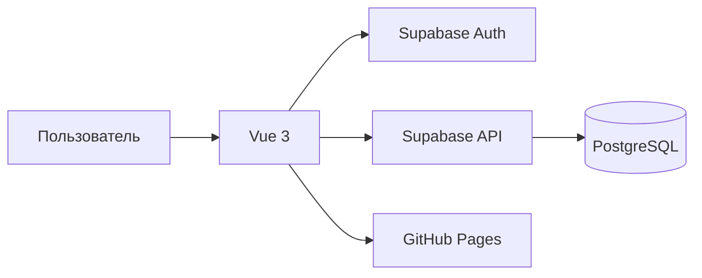
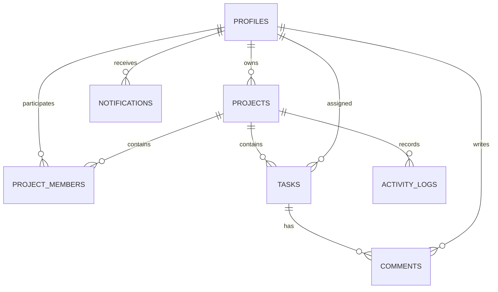

# Архитектура проекта

Приложение состоит из клиентской части Vue и облачного сервиса Supabase.

## Основные модули

- авторизация и регистрация;
- профиль пользователя;
- проекты и участники;
- задачи, комментарии и журнал действий;
- уведомления;
- административная панель.

## Таблицы базы данных

Доступ к строкам таблиц ограничивается правилами Row Level Security. Пользователь видит только проекты, в которых он состоит. Администратор имеет расширенный доступ.

